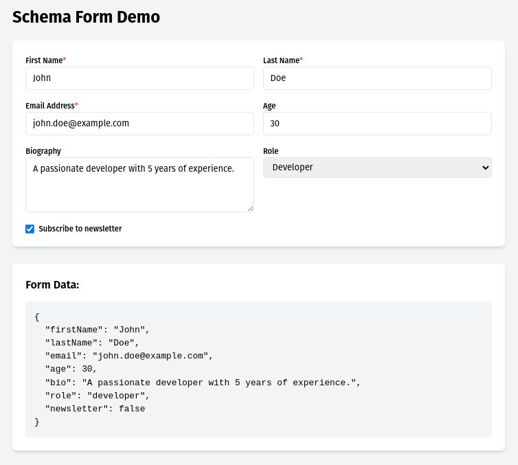

# Form Craft

```
const schema: Schema = {
  properties: {
    firstName: {
      type: 'string',
      label: 'First Name',
      description: 'Enter your first name',
      minLength: 2,
      maxLength: 50
    },
    lastName: {
      type: 'string',
      label: 'Last Name',
      description: 'Enter your last name',
      minLength: 2,
      maxLength: 50
    },
    email: {
      type: 'string',
      label: 'Email Address',
      description: 'Enter your email address'
    },
    age: {
      type: 'integer',
      label: 'Age',
      minimum: 0,
      maximum: 150
    },
    bio: {
      type: 'string',
      label: 'Biography',
      format: 'textarea',
      description: 'Tell us about yourself'
    },
    role: {
      type: 'string',
      label: 'Role',
      options: [
        { label: 'Developer', value: 'developer' },
        { label: 'Designer', value: 'designer' },
        { label: 'Manager', value: 'manager' }
      ]
    },
    newsletter: {
      type: 'boolean',
      label: 'Subscribe to newsletter'
    }
  },
  required: ['firstName', 'lastName', 'email']
};
```

it Generates the following

# DEMO


    ```markdown
    
    ```